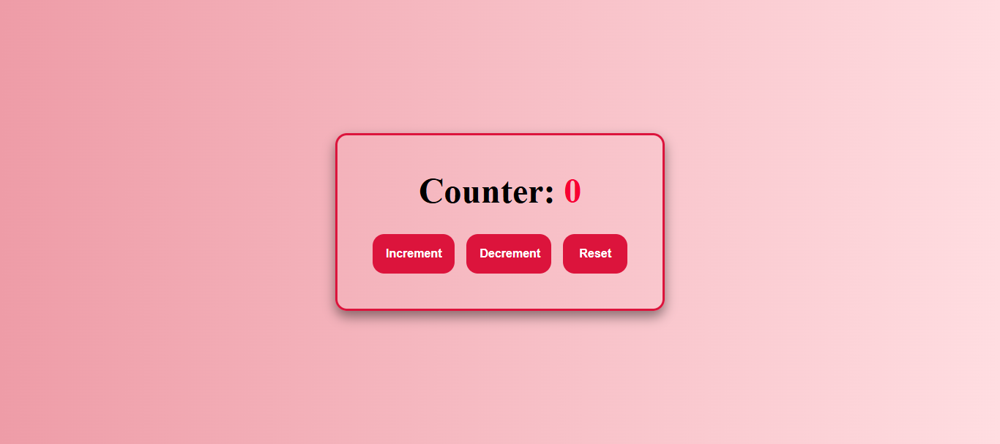

# Counter App with Limit Alerts

A beginner-friendly Counter App built using **HTML**, **CSS**, and **JavaScript**. This project is perfect for those learning frontend development and practicing DOM manipulation with real-time logic.

## 🚀 Features

- ✅ Increment, Decrement, and Reset functionality
- 🚫 Prevents going below 0 or above 10
- ⚠️ Displays alert messages when minimum or maximum limit is reached
- 🔒 Disables buttons when limits are hit
- 🧠 Clean and readable logic using functions and event listeners

## 📸 Preview

## 📁 Folder Structure

counter-app-with-limit-alerts/
│
├── index.html → Markup structure
├── style.css → Custom styles
└── script.js → JavaScript logic

## 📚 Concepts Covered

- DOM Selection & Manipulation
- Event Listeners (`click`)
- Conditional Logic (`if`, `else if`, `else`)
- UI Feedback (innerText, classList)
- Disabling/enabling buttons

## 🛠️ How to Use

1. Clone the repo or download the ZIP.
2. Open `index.html` in your browser.
3. Try clicking the buttons to test the app behavior.
4. Study the code to understand how everything works.

## 🎯 Ideal For

- Frontend development practice
- JavaScript beginners
- YouTube tutorial followers
- Portfolio mini projects

## 📺 Watch the Tutorial

**YouTube Playlist (Coming Soon)**  
Subscribe on YouTube: [DevCraft Projects](https://www.youtube.com/@devcraftprojects)

## 🔗 Connect with Me

- 💼 GitHub: [syed-muhammad-talha](https://github.com/syed-muhammad-talha)
- 📺 YouTube: [DevCraft Projects](https://www.youtube.com/@devcraftprojects)

---

> Made with ❤️ for the frontend community — keep building, keep learning!
